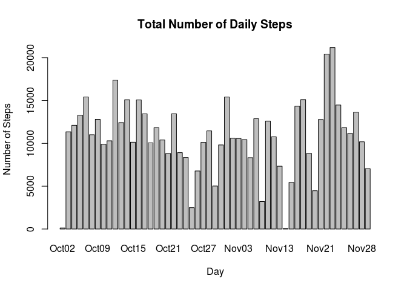
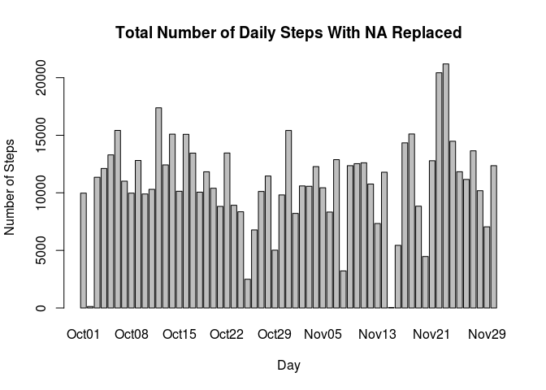
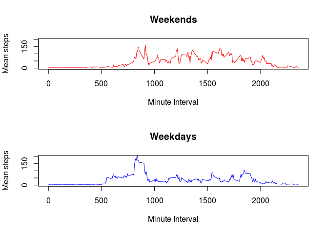

# Reproducible Research: Peer Assessment 1
Marcel Vidale  
16/11/2014  


#### Loading and preprocessing the data


```r
activity_na <- read.csv(file = "activity.csv", sep = ",")
activity <- na.omit(activity_na)
```

#### What is mean total number of steps taken per day?

1. Make a histogram of the total number of steps taken each day


```r
daily_steps <- aggregate(activity$steps, by = list(activity$date), sum)
colnames(daily_steps) <- c("date", "steps")
```

 

2. Calculate and report the mean and median total number of steps taken per day


```r
# Mean
mean_no_na <- mean(daily_steps$steps)
```


```r
# Median
median_no_na <- median(daily_steps$steps)
```

#### What is the average daily activity pattern?

1. Make a time series plot (i.e. type = "l") of the 5-minute interval (x-axis) 
and the average number of steps taken, averaged across all days (y-axis)


```r
dailyMeanPattern <- aggregate(activity$steps, by = list(activity$interval), mean)
plot(dailyMeanPattern, xlab = "Minute Interval", ylab = "Mean Number of Steps", type = "l", main = "Average Daily Activity Pattern")
```

 

2. Which 5-minute interval, on average across all the days in the dataset, 
contains the maximum number of steps?


```r
colnames(dailyMeanPattern) <- c("Interval", "Maximum Steps")
out <- dailyMeanPattern[dailyMeanPattern$'Maximum Steps' == max(dailyMeanPattern$'Maximum Steps'),]
out$Interval
```

```
## [1] 835
```

#### Inputing missing values

1. Calculate and report the total number of missing values in the dataset (i.e. the total number of rows with NAs)


```r
nrow(activity_na) - nrow(activity)
```

```
## [1] 2304
```

#### Replacement values
2. Devise a strategy for filling in all of the missing values in the dataset. The strategy does not need to be sophisticated. For example, you could use the mean/median for that day, or the mean for that 5-minute interval, etc.

The strategy will be to replace the missing values with the mean for that day divided by 288 the number of intervals
found in each day effectively making each interval the same value.


```r
# Add the day of the week to the original activity
df <- activity_na
df$day <- weekdays(as.Date(df$date))

# aggregate by date and then day
agg <- aggregate(df$steps, by = list(df$date, df$day), sum)
colnames(agg) <- c("date", "day", "steps")

# Find the daily means
dailyMeans <- aggregate(as.integer(agg$steps), by = list(agg$day), mean, na.rm = TRUE)
colnames(dailyMeans) <- c("day", "mean")
dailyMeans <- transform(dailyMeans, mean = as.integer(mean))

# For each of the seven days replace NA values with the daily mean for df set
df$steps[is.na(df$steps) & df$day=='Monday'] <- dailyMeans$mean[dailyMeans$day == 'Monday']/288
df$steps[is.na(df$steps) & df$day=='Tuesday'] <- dailyMeans$mean[dailyMeans$day == 'Tuesday']/288
df$steps[is.na(df$steps) & df$day=='Wednesday'] <- dailyMeans$mean[dailyMeans$day == 'Wednesday']/288
df$steps[is.na(df$steps) & df$day=='Thursday'] <- dailyMeans$mean[dailyMeans$day == 'Thursday']/288
df$steps[is.na(df$steps) & df$day=='Friday'] <- dailyMeans$mean[dailyMeans$day == 'Friday']/288
df$steps[is.na(df$steps) & df$day=='Saturday'] <- dailyMeans$mean[dailyMeans$day == 'Saturday']/288
df$steps[is.na(df$steps) & df$day=='Sunday'] <- dailyMeans$mean[dailyMeans$day == 'Sunday']/288
```

Summary for the steps for median and mean.


```r
summary(df$steps)
```

```
##    Min. 1st Qu.  Median    Mean 3rd Qu.    Max. 
##    0.00    0.00    0.00   37.57   34.63  806.00
```
3. Create a new dataset that is equal to the original dataset but with the missing data filled in.


```r
# This is the previously created dataset df
```

4. Make a histogram of the total number of steps taken each day.  Do these values differ from the estimates from the first part of the assignment? What is the impact of imputing missing data on the estimates of the total daily number of steps?

```r
daily_steps_replaced_na <- aggregate(df$steps, by = list(df$date), sum)
colnames(daily_steps_replaced_na) <- c("date", "steps")
```

 

* Calculate and report the mean and median total number of steps taken per day.

```r
# mean
mean_na_replaced <- mean(daily_steps_replaced_na$steps)
mean_na_replaced
```

```
## [1] 10821.11
```

```r
# median
median_na_replaced <- median(daily_steps_replaced_na$steps)
median_na_replaced
```

```
## [1] 11015
```
* Differences between mean/median with/without NA replaced

```r
# differences
# mean
mean_na_replaced - mean_no_na
```

```
## [1] 54.92607
```

```r
# median
median_na_replaced - median_no_na
```

```
## [1] 250
```


The mean value both the mean and median values increased when replacement was done.

#### Are there differences in activity patterns between weekdays and weekends?

1. Create a new factor variable in the dataset with two levels – “weekday” and “weekend” indicating whether a given date is a weekday or weekend day.


```r
df$indWeekend <- df$day=="Saturday" | df$day=="Sunday"
```


2. Make a panel plot containing a time series plot (i.e. type = "l") of the 5-minute interval (x-axis) and the average number of steps taken, averaged across all weekday days or weekend days (y-axis). 


```r
dailyMeanPatternT <- aggregate(df$steps[df$indWeekend==TRUE], by = list(df$interval[df$indWeekend==TRUE]), mean)
dailyMeanPatternF <- aggregate(df$steps[df$indWeekend==FALSE], by = list(df$interval[df$indWeekend==FALSE]), mean)

par(mfrow=c(2,1))
plot(dailyMeanPatternT, xlab = "Minute Interval", ylab = "Mean steps", type = "l", col="red", main="Weekends", ylim=c(0,200))
plot(dailyMeanPatternF, xlab = "Minute Interval", ylab = "Mean steps", type = "l", col="blue", main="Weekdays", ylim=c(0,200))
```

 

Weekdays show the highest spike in activity whereas the weekends are overall 
more active. A possible reason for the weekday spike is people getting ready to
go to work.

